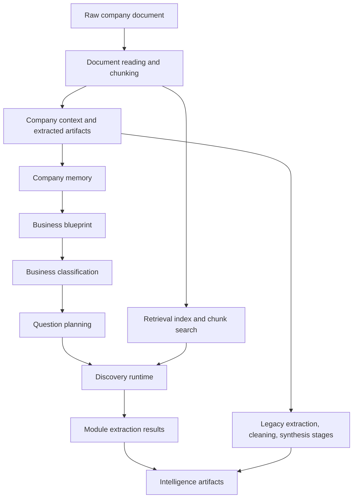

# Architecture Map

Audience: Engineers.

This document explains the high-level architecture reflected in the current governance inventory. It does not contain sprint status.

## Major System Flow

## Canonical Data Flow

The current inventory identifies this data flow as implemented in repository code:

1. A company/year context is created by `core.company_context.CompanyContext`.
2. Pipeline context is stored through `pipelines.pipeline_context`.
3. Raw annual-report files are read by document utilities such as `scripts.pdf_reader`.
4. Clean chunks are produced by chunking utilities such as `scripts.smart_chunker`.
5. Company memory is built by `knowledge.company_memory`.
6. A business blueprint is produced by `knowledge.business_interpreter`.
7. A business classification is produced by `knowledge.business_classifier`.
8. A discovery plan is produced by `knowledge.question_engine`.
9. Retrieval support is provided by `knowledge.retrieval`.
10. Module execution is coordinated by `knowledge.discovery_runtime` and `knowledge.module_extractor`.
11. Intelligence outputs are written under the active company context.

Which pipeline should be treated as the canonical production route is not established. Needs Architecture Review.

## Major Modules

- `core/`: shared context and base abstractions.
- `pipelines/`: stage-oriented orchestration and pipeline context.
- `scripts/`: document utilities, chunking utilities, manual/sample workflows, and older RAG/embedding scripts.
- `knowledge/`: central intelligence layer, including PCIM/CIM helpers, company memory, business understanding, question planning, retrieval, and discovery runtime.
- `discovery/`: domain discovery stages used by the stage-oriented company pipeline.
- `extractors/`: domain extraction stages used by the stage-oriented company pipeline.
- `processors/`: cleaning stages used by the stage-oriented company pipeline.
- `synthesis/`: intelligence synthesis stages used by the stage-oriented company pipeline.
- `configs/`, `models/`, `filters/`, `consolidators/`, `embeddings/`, `utils/`: supporting configuration, models, utilities, and older or specialized processing.

## Pipeline Overview

- `pipelines/run_company_pipeline.py`
  - Stage CLI for business understanding, discovery, extraction, cleaning, and intelligence.
  - Appears in current governance as a production candidate.
  - Canonical production status: Needs Architecture Review.

- `run_business_pipeline.py`
  - End-to-end document pipeline that includes raw document reading, chunking, company memory, business blueprint, classification, retrieval, question planning, and discovery runtime.
  - Appears in current governance as production candidate or newer experimental pipeline.
  - Canonical production status: Needs Architecture Review.

- `knowledge/business_understanding/pipeline.py`
  - Reusable business-understanding stage.
  - Used by `pipelines/run_company_pipeline.py`.
  - Canonical stage status: Needs Architecture Review.

- `scripts/run_pdf_pipeline.py`, `scripts/run_pipeline.py`, `scripts/embed.py`, `scripts/chunk_and_embed.py`, `scripts/rag.py`
  - Current governance records these as experimental, legacy, stale-looking, or manual/sample workflows.
  - Merge targets and lifecycle status require review.

## Where Major Modules Belong

| Area | Belongs In | Notes |
| --- | --- | --- |
| Company/year runtime context | `core/`, `pipelines/pipeline_context.py` | Shared orchestration infrastructure. |
| Raw document reading and chunking | `scripts/` today; canonical package location needs review | `scripts.smart_chunker` has tests; older `scripts.chunker` also exists. Needs Architecture Review. |
| Company memory | `knowledge/company_memory/` | Data contract and persistence layer for company memory. |
| Business blueprint | `knowledge/business_blueprint/` | Business-understanding schema and validation. |
| Business interpretation | `knowledge/business_interpreter/` | AI-assisted conversion from company memory to blueprint. |
| Business classification | `knowledge/business_classifier/` | Deterministic classification profiles. |
| Question planning | `knowledge/question_engine/` | Discovery-plan construction and validation. |
| Retrieval | `knowledge/retrieval/` | Chunk loading, embedding/indexing, BM25, hybrid retrieval. |
| Module extraction | `knowledge/module_extractor/` | Prompting, parsing, and validation for module answers. |
| Discovery runtime | `knowledge/discovery_runtime/` | Plan execution, retrieval coordination, result merging, statistics. |
| CIM/PCIM intelligence model | `knowledge/` root modules | Current canonical contract status needs review. |
| Domain extraction and cleaning | `discovery/`, `extractors/`, `processors/` | Used by stage pipeline. Relationship to newer discovery runtime needs review. |
| Synthesis | `synthesis/` | Used by stage pipeline intelligence stage. |

## Architecture Questions

- Which orchestration path is canonical for production: `pipelines/run_company_pipeline.py`, `run_business_pipeline.py`, or a future merged path? Needs Architecture Review.
- Should chunking utilities remain under `scripts/` or move behind a package API in a later phase? Needs Architecture Review.
- Are CIM outputs, `company_knowledge.json`, and discovery-runtime outputs all active contracts? Needs Architecture Review.
- How should legacy CAPEX-only flows relate to broader discovery/extraction pipelines? Needs Architecture Review.

