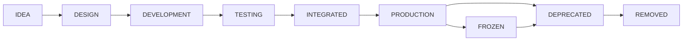

# Module Lifecycle

Purpose: Define repository lifecycle states for modules, pipelines, scripts, schemas, and data contracts.

## IDEA

- Purpose: Capture a proposed module, workflow, or architectural capability.
- Allowed Changes: Notes, sketches, governance entries, problem statements.
- Exit Criteria: Purpose, owner, affected area, and proposed merge target are documented.

## DESIGN

- Purpose: Define architecture, data contracts, module boundaries, and integration path before implementation.
- Allowed Changes: Design documents, architecture maps, integration-plan updates, test strategy.
- Exit Criteria: Architecture review is complete, canonical location is identified, and test expectations are documented.

## DEVELOPMENT

- Purpose: Implement the module or change behind an approved design.
- Allowed Changes: Production code, tests, documentation, fixtures, scripts required by the approved design.
- Exit Criteria: Local module behavior is complete and ready for standalone verification.

## TESTING

- Purpose: Prove standalone correctness and expected failure behavior.
- Allowed Changes: Tests, fixtures, deterministic mocks, small implementation fixes required by tests.
- Exit Criteria: Standalone tests pass and coverage expectations from design are met.

## INTEGRATED

- Purpose: Connect the module to its consuming pipeline or package boundary.
- Allowed Changes: Integration wiring, boundary tests, documentation updates.
- Exit Criteria: Integrated tests pass, consumers are documented, and rollback path is understood.

## PRODUCTION

- Purpose: Mark the module as an approved production implementation.
- Allowed Changes: Feature work, bug fixes, performance improvements, tests, governance updates.
- Exit Criteria: Production owner, support expectations, and lifecycle policy are documented.

## FROZEN

- Purpose: Stabilize a production module or contract where change risk is high.
- Allowed Changes: Critical fixes, security fixes, documentation clarifications, approved compatibility updates.
- Exit Criteria: Freeze is lifted by architecture review or module moves to deprecated.

## DEPRECATED

- Purpose: Keep a non-canonical module available while migration or replacement is planned.
- Allowed Changes: Documentation, compatibility fixes, migration helpers, critical breakage fixes.
- Exit Criteria: Consumers are migrated or removal is explicitly approved.

## REMOVED

- Purpose: Record that a module has been intentionally removed after governance approval.
- Allowed Changes: Governance record updates and references to historical removal decision.
- Exit Criteria: None. This is a terminal state.

## Required Lifecycle Metadata

- Module name.
- Current lifecycle state.
- Owner.
- Canonical location.
- Merge target, if not canonical.
- Required tests.
- Current blockers.
- Decision date.

Unknown values must be recorded as `Needs Architecture Review`.

